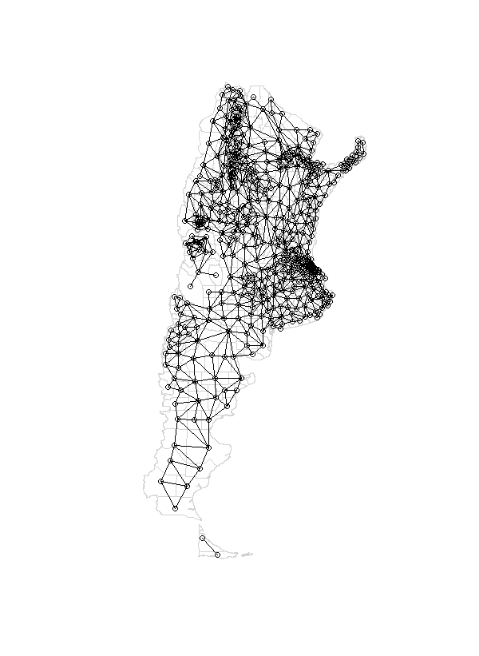
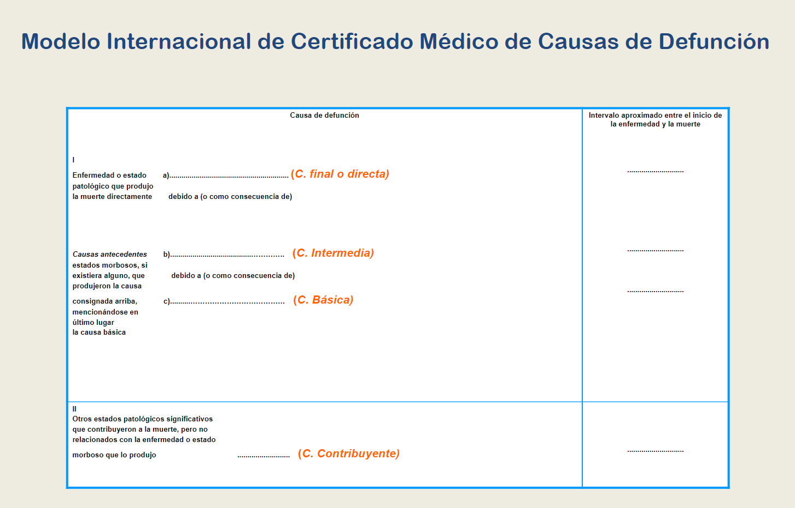
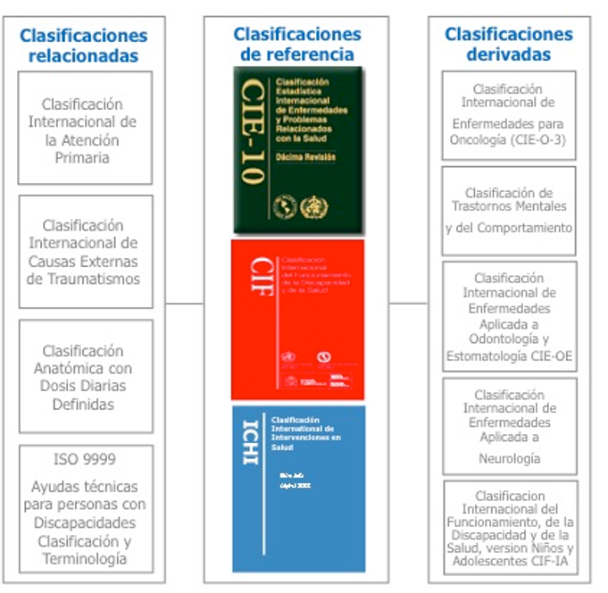
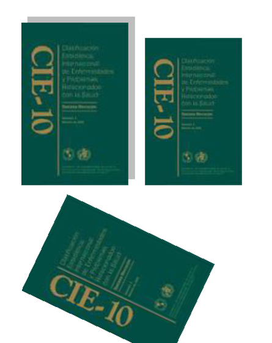

```{r setup, include=FALSE}
knitr::opts_chunk$set(
  echo = FALSE,
  warning = FALSE,
  message = FALSE,
  comment = "##",
  fig.width = 10
)

```

```{r}
library(tidyverse)
```

```{r}
ruta <- "C:/Users/NaranjaX/Documents/Mis Documentos/EnfermedadesDesatendidas/"


load(paste0(ruta,"Reporte/tasas_esp.RData"))
load(paste0(ruta,"Reporte/piramide.RData"))

```

```{r xaringan-panelset, echo=FALSE}
xaringanExtra::use_panelset()
```

```         
<style> body { text-align: justify} </style> 
```

## ¿Que son las enfermedades desatendidas?

Las ETD comprenden un grupo de **entidades nosológicas** que se
distinguen por estar directamente relacionadas con **malas condiciones
de vida** (residentes de zonas rurales remo tas, barrios marginales,
grupos étnicos relegados o zonas de confl icto), con acceso inadecuado a
los servicios de salud, la educación, al agua potable y al saneamiento
básico, y con ambientes tropicales (@1, @2, @3, @4).

**Aunque la mayoría de esas enfermedades tengan tratamiento y sean
curables** con medicamentos que cuestan menos de un dólar por dosis o
son donados a través de la Organización Panamericana de la Salud (OPS),
el perfil poblacional de los enfermos repercute poco en la agenda de
prioridades de la salud pública, básicamente por su escasa incidencia en
las decisiones políticas. Además, la inversión en investigación y
desarrollo de nuevos y mejores medicamentos es escasa: sólo 4,4% de los
nue vos productos aprobados entre 2000 y 2011 fueron para ETD, la
mayoría formulaciones nuevas o combinaciones de drogas ya existentes. La
ausencia de estadísticas confiables también con tribuye a su reducida
visibilidad (@1, @2, @5).

-   Este grupo de enfermedades incluye:

-   dengue

-   rabia

-   ceguera por tracoma

-   úlcera de Buruli

-   treponematosis

-   lepra (o enfermedad de Hansen)

-   enfermedad de Chagas

-   leishmaniasis

-   cisticercosis

-   equinococosis o hidatidosis

-   filariasis

-   esquistosomiasis

-   helmintiasis

-   entre otras

### Estadísticas Argentina

-   Lepra:

    -   En 2022 había 343 casos de lepra en tratamiento y 142 casos
        nuevos registrados (@7).

-   Leishmaniasis:

    -   128 casos de leishmanianiasis (en cualquiera de sus formas)
        (@7).

-   Enfermedad de Chagas

    -   En Argentina se calcula que cerca de un millón y medio de
        personas tienen Chagas (@6) .

    -   A 2022, en 9 provincias existe transmisión vectorial de la
        Enfermedad de Chagas (@6).

    -   La transmision vertical (materno infantil) es en la actualidad
        el principal mecanismo de transmisión en nuestro país (@6).

    -   En el período 2019-2021 para el evento Chagas congénito/vertical
        con diagnóstico confirmatorio, se notificó el inicio del
        tratamiento en el 25% para el 2019, y en el 34% para los años
        2020 y 2021 (@6).

    -   Más del 80% de los casos reportados como "Chagas Agudo
        Congénito/Vertical" no registra el diagnóstico completo que
        permita confirmar o descartar la infección por T. cruzi (@6).

-   Equinocococis

## Atecedentes

[{width="800"}](https://iris.paho.org/bitstream/handle/10665.2/51493/v43e672019.pdf?sequence=1&isAllowed=y)

## Metodología

-   Estudio ecológico transversal, tomando los departamentos de la
    Argentina como unidad de análisis. Excepto Ciudad de Buenos Aires
    que se la tomo como una unidad dado que la organización politica es
    incompatible (circunscripción electoral vs comunas).

-   Período 2004-2018, ambos sexos (suma varones, mujeres y sin
    definición).

-   Se calcularon:

    -   Las razones de mortalidad estandarizadas (RME) tomando como
        referencia la tasas específicas por edad para ambos sexos de
        Argentina.

        $Muertes esperadas=∑i​Ei​$

    -   Las RME fueron suavizadas mediante metodo Bayesiano Local: el
        bjetivo es "pesar" la información del área que nos interesa; es
        decir, ponderar los datos de mortalidad de una determinada área
        junto con la información sobre la distribución de la mortalidad
        del resto de las áreas y/o de un conjunto de ellas (áreas
        adyacentes)

    -   Análisis Espacial e identificación de clúster: este metodo
        método (también llamado LISA Indicadores Locales de Asociación
        Espacial) descompone el índice I de Moran y verifica en cuánto
        contribuye cada unidad espacial a la formación del valor
        general, permitiendo obtener un valor de significancia para cada
        cluster formado por los valores similares de cada unidad
        espacial y sus vecinos. Estos agrupamientos o clusters de
        especial concentración de valores extremos de una variable se
        conocen también como zonas calientes/frías (hot spots/cold
        spots, respectivamente) según se trate de una concentración de
        valores especialmente altos/bajos de una variable,
        correspondientemente.

    Si tomamos los valores de una unidad espacial y la de sus vecinos y
    comparamos ambos con los valores medios (de la unidad y del vecino),
    podemos obtener:

    +---------------+---------------+
    | Bajo en X     | Alto en X     |
    |               |               |
    | Alto en Y     | Alto en Y     |
    +:=============:+:=============:+
    | **Bajo en X** | **Alto en X** |
    |               |               |
    | **Bajo en Y** | **Bajo en Y** |
    +---------------+---------------+

    : **Moran Scatterplot**

## Matriz de vecindad para la Argentina por departamentos

```{r, echo=FALSE, out.width="75%"}

```

## Fuente de datos

¿Cómo se genera la información de mortalidad?

[](https://www.argentina.gob.ar/salud/deis)

¿Qué es el Informe Estadístico de Defunción?



¿Que es la CIE?

::: {style="display: grid; grid-template-columns: 1fr 1fr; grid-column-gap: 10px; "}
<div>



</div>

<div>

[](https://ais.paho.org/classifications/chapters/)

</div>
:::

<br>

## Resultados

### Descripción de la muestra

En el período de estudio (2004-2018), se registraron
`r scales::comma(tasas_esp$casos[tasas_esp$sexo== '3.Ambos sexos' & tasas_esp$edadquinq == '18.Total'],big.mark = ".",decimal.mark = ",")`defunciones
por Enfermedades Desatendidas, de las cuáles
`r round(tasas_esp$casos[tasas_esp$sexo== '1.Varones' & tasas_esp$edadquinq == '18.Total']*100/tasas_esp$casos[tasas_esp$sexo== '3.Ambos sexos' & tasas_esp$edadquinq == '18.Total'])`%
(`r scales::comma(tasas_esp$casos[tasas_esp$sexo== '1.Varones' & tasas_esp$edadquinq == '18.Total'],big.mark = ".",decimal.mark = ",")`)
se dieron en varones y
`r round(tasas_esp$casos[tasas_esp$sexo== '2.Mujeres' & tasas_esp$edadquinq == '18.Total']*100/tasas_esp$casos[tasas_esp$sexo== '3.Ambos sexos' & tasas_esp$edadquinq == '18.Total'])`%
(`r scales::comma(tasas_esp$casos[tasas_esp$sexo== '2.Mujeres' & tasas_esp$edadquinq == '18.Total'],big.mark = ".",decimal.mark = ",")`)
en mujeres.

::: panelset
::: panel
### Distribución de las defunciones por edad {.panel-name}

```{r piramide_edad}
ggplot(distr_edad,aes(x= edadquinq, fill= sexo ,y= ifelse(sexo== '1.Varones',casos,-casos)))+
  geom_bar(stat= 'identity')+
  scale_y_continuous(
    labels = abs, 
    limits = max(distr_edad$casos) * c(-1,1)
  ) + 
  scale_fill_manual(values=c("#E6F5D0","#F1B6DA"),labels=c("Varones","Mujeres"))+
  scale_x_discrete(labels= substring(distr_edad$edadquinq,4,str_length(distr_edad$edadquinq)))+
  coord_flip() + 
  theme_minimal() +
  labs(
    x = "Edad Quinquenal", 
    y = "Casos", 
    fill = "Sexo", 
    title = "Distribución de los casos por edad"
  )

```
:::

::: panel
### Tasas específicas por edad {.panel-name}

```{r tasas_especificas_edad}
ggplot(tasas_esp %>% filter(edadquinq != '18.Total'),
       aes(x= edadquinq, y= tasa, color= sexo))+
  geom_point()+
  geom_errorbar(aes(ymin= IC_inf, ymax= IC_sup))+
  scale_x_discrete(labels= substring(distr_edad$edadquinq,4,str_length(distr_edad$edadquinq)))+
  scale_color_manual(values=c("#7FBC41","#F1B6DA","#8E0152"),labels=c("Varones","Mujeres","Ambos sexos"))+
  labs(x= "Edad Agrupada", y= "Tasa de mortalidad \n (por 1 millon de hab.)",
       color= "Sexo")

```
:::

::: panel
### Tasas específicas por sexo {.panel-name}

```{r tasas_especificas_sexo}
ggplot(tasas_esp %>% filter(edadquinq == '18.Total'),
       aes(x= sexo, y= tasa, color= sexo))+
  geom_point()+
  geom_errorbar(aes(ymin= IC_inf, ymax= IC_sup))+
  scale_x_discrete(labels=c("Varones","Mujeres","Ambos sexos"))+
  scale_color_manual(values=c("#7FBC41","#F1B6DA","#8E0152"),labels=c("Varones","Mujeres","Ambos sexos"))+
  labs(x= "Edad Agrupada", y= "Tasa de mortalidad \n (por 1 millon de hab.)",
       color= "Sexo")

```
:::
:::

::: panelset
::: panel
### Total NTD {.panel-name}

```{r map_total_ntd}


```
:::

::: panel
### Lepra {.panel-name}

```{r map_lepra}


```
:::

::: panel
### Leishmaniasis {.panel-name}

```{r map_leishmaniasis}


```
:::

::: panel
### Equinococosis {.panel-name}

```{r map_equinococosis}


```
:::
:::

## Discusión

Los resultados de este estudio muestran una fuerte relación entre la
mortalidad por ETD y el sexo y la edad. En el período estudiado, más de
la mitad de los fallecidos por ETD fueron hombres:

-   Otros autores lo atribuyen al hecho de que los hombres son menos
    propensos a buscar tratamiento temprano (@30, @31).

-   Mayor tiempo de exposición en sus actividades laborales (@32).

-   En Argentina, las mujeres refieren peores estados de salud
    autopercibidos que los hombres, lo que puede influir en la búsqueda
    de atención (@33, @34).

La distribución espacial de las ETD, a excepción de la equinococosis,
muestra mayor riesgo de mortalidad, en el noroeste y el noreste de
Argentina:

-   La asociación entre pobreza, urbanización y ETD ha sido analizada
    por diversos investigadores (@1 ,@30 , @31, @35).

-   En las provincias que integran estas regiones se detectan los
    porcentajes medios de hogares con necesidades básicas insatisfechas
    (que miden condiciones materiales de vida) de 25% en 2001 y de 17%
    en 2010, 1,8 veces más altos que el porcentaje nacional (@36).

-   La mayor mortalidad por equinococis en la patagonia, podría estar
    relacionado con el hecho de que en esta zona se concentra la
    producción ovina del país y a que el autoconsumo tiene valores
    mayores que la media nacional (@1,@37, @38)

¿Que podemos decir desde las "dimensiones del campo de salud?

Zabala sostiene que "[...] la enfermedad de Chagas no ha sido tan
olvidada como para desaparecer de la agenda, ni tan recordada como para
cortar definitivamente su ciclo de reproducción" ( @42).

### Limitaciones

-   El análisis de la mortalidad por ETD como causa básica presenta
    algunas limitaciones, como la subestimación y el subregistro (@30,
    @31, @46). Si el médico que registra la defunción selecciona como
    causa básica las consecuencias de las ETD, la mortalidad se verá
    subestimada. Un estudio sobre mortalidad por enfermedad de Chagas
    según causas múltiples realizado en Saõ Paulo (Brasil) entre 1985 y
    2006 mostró que cuando ésta es la causa básica de defunción, las
    causas asociadas son trastornos de la conducción/arritmias (39%) e
    insuficiencia cardíaca (34%) (46). En cambio, las principales causas
    básicas cuando la enfermedad de Chagas se registra como causa
    asociada son la enfermedad isquémica del corazón (22%) y enfermedad
    cerebrovascular (16,8%).

## Bibliografia

```         
<div id="refs"></div>
```
