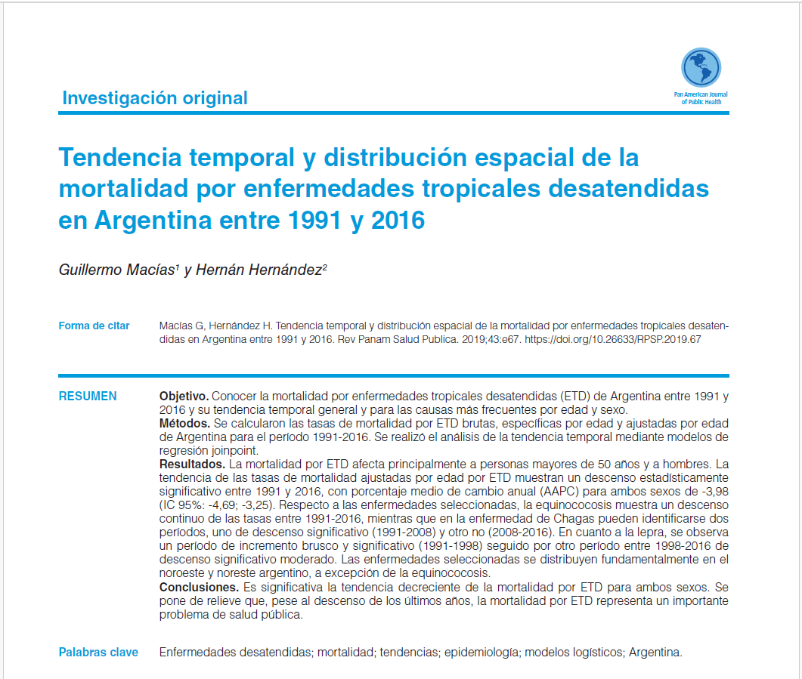
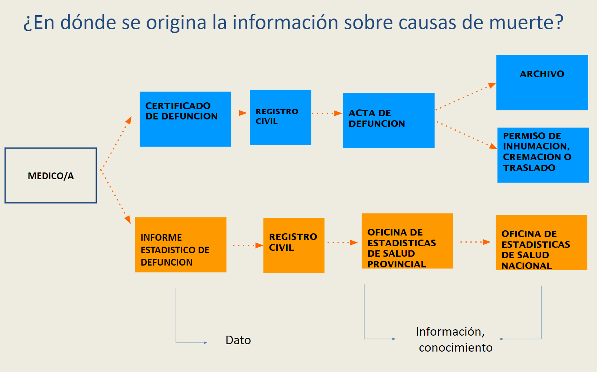

```{r setup, include=FALSE}
knitr::opts_chunk$set(
  echo = FALSE,
  warning = FALSE,
  message = FALSE,
  comment = "##",
  fig.width = 10
)

```

```{r}
ruta <- "C:/Users/NaranjaX/Documents/Mis Documentos/EnfermedadesDesatendidas/"

load(paste0(ruta,"tasas/tasas_ntd_suav.RData"))
load(paste0(ruta,"tasas/tasas_02.Leishmaniasis_suav.RData"))
load(paste0(ruta,"tasas/tasas_chagas_suav.RData"))
load(paste0(ruta,"tasas/tasas_Equinococosis_suav.RData"))
load(paste0(ruta,"tasas/tasas_Lepra_suav.RData"))

```

```{r xaringan-panelset, echo=FALSE}
xaringanExtra::use_panelset()
```

## ¿Que son las enfermedades desatendidas?

Las ETD comprenden un grupo de **entidades nosológicas** que se
distinguen por estar directamente relacionadas con **malas condiciones
de vida** (residentes de zonas rurales remo tas, barrios marginales,
grupos étnicos relegados o zonas de confl icto), con acceso inadecuado a
los servicios de salud, la educación, al agua potable y al saneamiento
básico, y con ambientes tropicales (1-4).

**Aunque la mayoría de esas enfermedades tengan tratamiento y sean
curables** con medicamentos que cuestan menos de un dólar por dosis o
son donados a través de la Organización Panamericana de la Salud (OPS),
el perfil poblacional de los enfermos repercute poco en la agenda de
prioridades de la salud pública, básicamente por su escasa incidencia en
las decisiones políticas. Además, la inversión en investigación y
desarrollo de nuevos y mejores medicamentos es escasa: sólo 4,4% de los
nue vos productos aprobados entre 2000 y 2011 fueron para ETD, la
mayoría formulaciones nuevas o combinaciones de drogas ya existentes. La
ausencia de estadísticas confiables también con tribuye a su reducida
visibilidad (1,2,5).

-   Este grupo de enfermedades incluye:

-   dengue

-   rabia

-   ceguera por tracoma

-   úlcera de Buruli

-   treponematosis

-   lepra (o enfermedad de Hansen)

-   enfermedad de Chagas

-   leishmaniasis

-   cisticercosis

-   equinococosis o hidatidosis

-   filariasis

-   esquistosomiasis

-   helmintiasis

-   entre otras

### Estadísticas Argentina (fuente: <https://www.who.int/data/gho/data/themes/topics/soil-transmitted-helminthiases>)

-   En 2022 había 343 casos de lepra en tratamiento y 142 casos nuevos
    registrados.
-   128 casos de leishmanianiasis (en cualquiera de sus formas)
-   

## Atecedentes

[](https://iris.paho.org/bitstream/handle/10665.2/51493/v43e672019.pdf?sequence=1&isAllowed=y)

## Metodología

-   Estudio ecológico transversal, tomando los departamentos de la
    Argentina como unidad de análisis. Excepto Ciudad de Buenos Aires
    que se la tomo como una unidad dado que la organización politica es
    incompatible (circunscripción electoral vs comunas).

-   Período 2004-2018, ambos sexos (suma varones, mujeres y sin
    definición).

-   Se calcularon:

    -   Las razones de mortalidad estandarizadas (RME) tomando como
        referencia la tasas específicas por edad para ambos sexos de
        Argentina.

        $Muertes esperadas=∑i​Ei​$

    -   Las RME fueron suavizadas mediante metodo Bayesiano Local: el
        bjetivo es "pesar" la información del área que nos interesa; es
        decir, ponderar los datos de mortalidad de una determinada área
        junto con la información sobre la distribución de la mortalidad
        del resto de las áreas y/o de un conjunto de ellas (áreas
        adyacentes)

    -   Análisis Espacial e identificación de clúster: este metodo
        método (también llamado LISA Indicadores Locales de Asociación
        Espacial) descompone el índice I de Moran y verifica en cuánto
        contribuye cada unidad espacial a la formación del valor
        general, permitiendo obtener un valor de significancia para cada
        cluster formado por los valores similares de cada unidad
        espacial y sus vecinos. Estos agrupamientos o clusters de
        especial concentración de valores extremos de una variable se
        conocen también como zonas calientes/frías (hot spots/cold
        spots, respectivamente) según se trate de una concentración de
        valores especialmente altos/bajos de una variable,
        correspondientemente.

    Si tomamos los valores de una unidad espacial y la de sus vecinos y
    comparamos ambos con los valores medios (de la unidad y del vecino),
    podemos obtener:

    +-------------+-------------+
    | Bajo en X   | Alto en X   |
    |             |             |
    | Alto en Y   | Alto en Y   |
    +:===========:+:===========:+
    | **Bajo en   | **Alto en   |
    | X**         | X**         |
    |             |             |
    | **Bajo en   | **Bajo en   |
    | Y**         | Y**         |
    +-------------+-------------+

    : **Moran Scatterplot**

## Matriz de vecindad para la Argentina por departamentos

```{r, echo=FALSE, out.width="75%"}
knitr::include_graphics("MatrizdeVencidadImagen.png")
```

## Fuente de datos

Dirección Estadística de Información de Salud (DEIS)




## Resultados

::: panelset
::: panel
### Total NTD {.panel-name}

```{r map_total_ntd}


```
:::

::: panel
### Lepra {.panel-name}

```{r map_lepra}


```
:::

::: panel
### Leishmaniasis {.panel-name}

```{r map_leishmaniasis}


```
:::

::: panel
### Equinococosis {.panel-name}

```{r map_equinococosis}


```
:::
:::

## Discusión

Este evento de vigilancia epidemiológica agrupa a: **ETI (Enfermedad
Tipo Influenza)**, **Neumonía**, **Bronquiolitis en menores de 2 años**
e **Infección respiratoria aguda internada (IRAG)**.

```{r media_semanal_ira}


```

```{r corredor_ira}


```

::: panelset
::: panel
### Conclusiones {.panel-name}

```{r corredor_ira_graf}

```
:::

::: panel
### Casos IRA por año {.panel-name}

```{r graf_ira}


```
:::
:::
